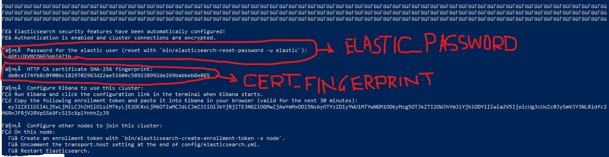

# BERTSemanticSearch Project

 

## Installation and Usage

To install this project on windows, follow these steps:

1. Clone the repository: `git clone https://github.com/sandipmore060622/Job-Search-with-Semantics-Search.git` on C drive

2. Download `elasticsearch-8.10.3-windows-x86_64.zip` from 
[elasticsearch](https://artifacts.elastic.co/downloads/elasticsearch/elasticsearch-8.10.3-windows-x86_64.zip)
 and copy it into `BERTSemanticSearch` folder.

3. Open power shell as administrator and Navigate to the project directory: `cd C:\BERTSemanticSearch`

4. Run : `Expand-Archive -Path ".\elasticsearch-8.10.3-windows-x86_64.zip" -DestinationPath ".\elasticsearch-8.10.3"`

5. Run : `cd ".\elasticsearch-8.10.3\elasticsearch-8.10.3"`

6. Run : `.\bin\elasticsearch.bat`

7. Note ELASTIC_PASSWORD and CERT_FINGERPRINT as per following image (observe output from above code run) and replace them in indexData.py and searchApp.py.

8. Run : `pip install -r requirements.txt`
 

9. Run : `python preprocessing.py` 

10. Run : `python indexData.py`

11. Run : `python searchApp.py`

12. Run : `streamlit run searchApp.py`

13. Open your web browser and go to `http://localhost:8501/`

## License

This project is licensed under the MIT License - see the [LICENSE](LICENSE) file for details.
